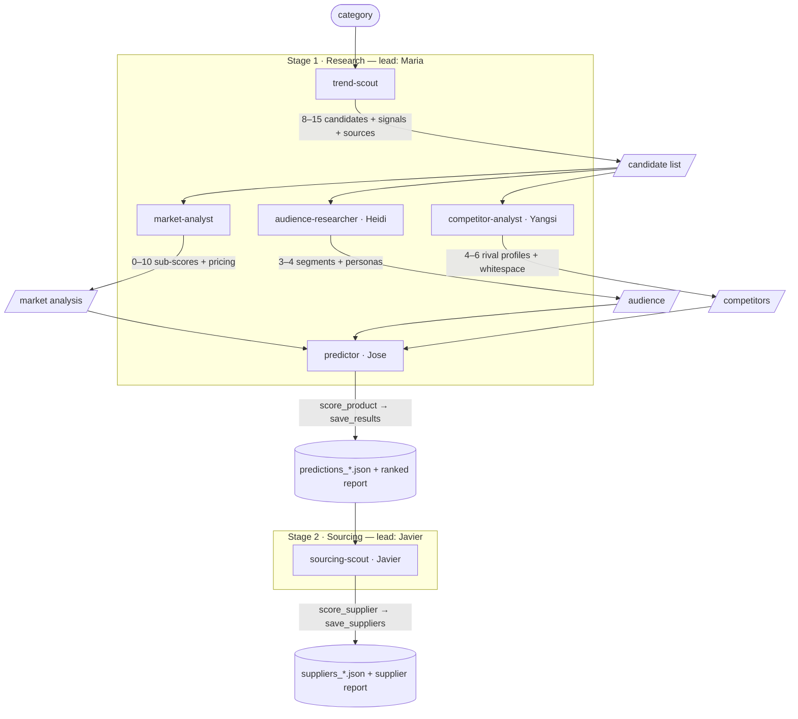

# Product Researcher — two Claude Agent SDK teams

Two **independent multi-agent teams** (Python + [Claude Agent SDK](https://platform.claude.com/docs/en/agent-sdk/python)) that work in sequence but are fully decoupled — each runs on its own:

1. **`product_researcher`** — scans the **live market** with web search and predicts which products are likely to become popular in a category. Writes `predictions_<category>.json`.
2. **`supplier_sourcer`** — reads that saved report, takes the top products, and finds the **best-quality, EU-certified manufacturers/suppliers** for each. Writes `suppliers_<category>.json`.

Because the sourcing agent works from the saved `predictions_*.json` rather than calling the research agent directly, the two can run independently — and in parallel on different categories.

## Agent 1 — product_researcher

A lead orchestrator delegates to five specialist subagents:

| Agent | Role |
|-------|------|
| **trend-scout** | Web-searches for specific emerging products + rising signals + sources |
| **market-analyst** | Scores each candidate 0–10 on demand, growth, margin, competition, feasibility, plus pricing |
| **audience-researcher** | Builds 3–4 target customer segments and buyer personas |
| **competitor-analyst** | Profiles rival brands: positioning, messaging, pricing, ad spend |
| **predictor** | Turns sub-scores into a deterministic 0–100 opportunity score and ranks them |

`score_product` (in-process tool) computes the transparent 0–100 opportunity score; `save_results` writes the JSON.

## Agent 2 — supplier_sourcer

A lead orchestrator delegates to one specialist subagent:

| Agent | Role |
|-------|------|
| **sourcing-scout** | For each top product, finds real manufacturers/suppliers and ranks up to 10, prioritising trustworthy reputation, high quality, and valid EU certifications |

`score_supplier` (in-process tool) computes a 0–100 supplier-quality score weighting **quality, reputation, EU certification (CE/ISO 9001/REACH/RoHS…), reliability and price**; `save_suppliers` writes the JSON. It reads the research agent's output via `predictions_<category>.json`.

## Data flow — agent inputs & outputs

Each agent's input and output, and how work threads between them:



**Execution order:** `trend-scout` → `market-analyst` → then **`audience-researcher` ∥ `competitor-analyst` in parallel** → `predictor` fans in once both finish → Stage 2 `sourcing-scout`. `market-analyst`, `audience-researcher` and `competitor-analyst` all consume the same candidate list; `predictor` combines the analysis, audience and competitor outputs. Threaded context is capped (~2,500 chars) between nodes to keep per-request tokens low. Amanda (orchestrator) runs Stage 1 → Stage 2 and stops before sourcing if research yields no products.

## Setup

Requires Python 3.10+.

```bash
cd agent_team
python -m venv venv && source venv/bin/activate
pip install -r requirements.txt

cp .env.example .env        # then paste your ANTHROPIC_API_KEY
```

Get a key at https://console.anthropic.com/.

## Sign in (email accounts)

The dashboard is gated by a simple **email + password** login. On first visit you'll see a sign-in screen — click **Sign up** to create an account (email + a password of at least 8 characters), and you'll be logged straight in. Your email shows in the top-right with a **Log out** link.

How it works: accounts live in a local SQLite file (`users.db`, gitignored) next to the app; passwords are stored as salted PBKDF2 hashes (never plaintext); login creates a server-side session referenced by an httpOnly cookie. All agent endpoints require a valid session. Override the DB location with `PR_USERS_DB=/path/to/users.db` if needed.

### Email verification (optional)

If you configure SMTP, signup sends a verification email with a confirmation link; until the user clicks it, a banner prompts them to verify (with a **Resend** button). By default verification is **informational** (it does not block usage). To *require* verification before running the agents, set `REQUIRE_VERIFICATION=true` — and even then it only enforces when SMTP is configured, so a broken mail setup can never lock anyone out.

**Password reset** is included too: the login screen has a **Forgot password?** link that emails a time-limited reset link (`/?reset=<token>`); opening it shows a "set a new password" form. Reset emails also require SMTP. To avoid leaking which emails have accounts, the forgot endpoint always returns the same response.

Set these in `.env` (the app reads them at startup):

```
SMTP_HOST=smtp.office365.com
SMTP_PORT=587
SMTP_USER=you@yourdomain.com
SMTP_FROM=you@yourdomain.com
SMTP_PASSWORD=        # see note below
APP_BASE_URL=http://127.0.0.1:8000   # used to build the verify link
```

Test SMTP before relying on it:

```bash
python -m product_researcher.mailer you@yourdomain.com
```

> **Office 365 note:** Microsoft disables basic SMTP AUTH by default. If the mailbox has MFA, `SMTP_PASSWORD` must be an **App Password** (not your normal password), and the tenant must allow SMTP AUTH for that mailbox — otherwise login fails with "5.7.139 authentication unsuccessful". If you can't enable it, consider a transactional email API (SendGrid, SES, Postmark) instead.

If SMTP isn't configured, signup still works — it just skips the email and shows an "email isn't verified" banner.

> **Security note:** this is lightweight auth for a self-hosted/local dashboard. It does **not** include email verification, password reset, or rate limiting, and the session cookie is sent over plain HTTP on localhost. Before exposing it publicly, put it behind **HTTPS** (and set the cookie `secure` flag), and add verification/reset/rate-limiting.

## Run — Web dashboard (recommended)

A local dashboard lets you launch a run and **watch the team work live** — which subagent is active, every web search and tool call, and the final report streaming in.

```bash
python -m product_researcher.server
# open http://127.0.0.1:8000
```

Type a category, pick Top N and a model, hit **Run research** (Stage 1). When that finishes, hit **🏭 Source suppliers** (Stage 2) to run the *separate* sourcing agent on the saved report. The left pane shows the live timeline and team status; the right pane renders the report with download links.

The dashboard streams events over Server-Sent Events: `GET /api/research` (research agent) and `GET /api/sourcing` (sourcing agent) — the same pipelines the CLIs use, so behaviour is identical.

## Run — CLI

The two agents are separate commands. Run research first, then sourcing reads its output:

```bash
# Agent 1 — research
python -m product_researcher.main "smart home gadgets" --top 8

# Agent 2 — sourcing (reads predictions_smart_home_gadgets.json from ./reports)
python -m supplier_sourcer.main "smart home gadgets" --top 3 --per 10

# Orchestrator (Amanda) — runs both stages in order, in one command
python -m orchestrator.main "smart home gadgets" --top 8 --source-top 3 --per 10
```

Useful options:

```bash
python -m product_researcher.main "eco-friendly pet products" --top 8 --out ./reports --model opus
python -m supplier_sourcer.main "eco-friendly pet products" --reports ./reports --top 3 --per 10
```

Output (written to `--out`/`--reports`, default `./reports`):

- `report_<category>.md` — executive summary + ranked product table + methodology (research agent)
- `predictions_<category>.json` — structured predictions; **the hand-off file** the sourcing agent reads
- `report_suppliers_<category>.md` — supplier shortlist report (sourcing agent CLI)
- `suppliers_<category>.json` — per-product supplier shortlists (name, country, score, tier, certifications, source)

## Test it locally

Step-by-step to get it running on your own machine (macOS/Linux).

**1. Create a virtual environment and install dependencies**

```bash
cd agent_team
python3 -m venv venv
source venv/bin/activate          # Windows: venv\Scripts\activate
pip install -r requirements.txt
```

**2. Add your Anthropic API key**

```bash
cp .env.example .env              # then edit .env and paste your key
```

```
ANTHROPIC_API_KEY=sk-ant-...
```

Get a key at https://console.anthropic.com/.

**3a. Run the web dashboard** (recommended)

```bash
python -m product_researcher.server
# open http://127.0.0.1:8000
```

Type a category (e.g. `smart home gadgets`), pick Top N and a model, hit **Run research**. The status dot in the top-left turns green when your key is detected.

**3b. Or run the CLI**

```bash
python -m product_researcher.main "smart home gadgets" --top 8
```

Outputs land in `./reports/` as `report_<category>.md` and `predictions_<category>.json`.

### Mock mode — test with no API key and no credits

You can run the **entire** pipeline offline with canned data — real subagent steps, tool calls, scoring, ranked report and JSON output — without an API key or spending anything. Great for trying the dashboard and seeing how it all works.

Dashboard: tick the **"Mock mode"** checkbox before hitting Run.

CLI:

```bash
python -m product_researcher.main "smart home gadgets" --top 5 --mock
```

Both agents support mock mode. In the dashboard tick **"Mock mode"** before clicking Run research or Source suppliers. On the CLI:

```bash
python -m product_researcher.main "smart home gadgets" --top 5 --mock
python -m supplier_sourcer.main "smart home gadgets" --top 3 --mock
```

The sourcing mock reads the **real** `predictions_*.json` if present (so it sources your actual top products), and falls back to canned products if none exists. Mock runs use the real scoring/save tools, so the generated `.md`/`.json` files are real — only the web "research" is simulated.

**Smoke test (no API credits used)** — confirm everything imports and wires up:

```bash
python -c "from product_researcher import server, events, agents, tools, core, mock; print('research OK')"
python -c "from supplier_sourcer import events, agents, tools, core, mock; print('sourcing OK')"
```

**Notes & troubleshooting**

- Requires **Python 3.10+** — check with `python3 --version`.
- A real research run makes live web searches and consumes API credits, so start with a small `--top` value.
- If `python3 -m venv` fails on macOS, install the command-line tools: `xcode-select --install`.
- The dashboard loads `marked.js` from a CDN to render the report, so it needs internet at view time (it already does, for web search).

## How it works

```
  AGENT 1 · product_researcher                         AGENT 2 · supplier_sourcer
  ┌───────────────────────────────────────┐           ┌──────────────────────────────────┐
  │ LEAD                                   │           │ LEAD                             │
  │   trend-scout → market-analyst →       │           │   sourcing-scout                │
  │   predictor → score_product (tool)     │           │   → score_supplier (tool)       │
  └───────────────────────────────────────┘           └──────────────────────────────────┘
               │                                                    ▲       │
               ▼                                                    │       ▼
        predictions_<category>.json  ───── reads the saved file ────┘   suppliers_<category>.json
```

The two agents are **decoupled**: the research agent writes `predictions_<category>.json`;
the sourcing agent reads it. So you can run them independently — re-source an old report,
or run research and sourcing for different categories in parallel.

## Project layout

Each subagent lives in **its own folder** under `agents/`, holding everything it
owns — its definition (`agent.py`) and, where it has them, its own tools and pure
scoring logic. Team-level pieces shared by the lead (the `save_*` tool, the JSON
writers, the predictions handoff) stay in each team's `tools.py`/`core.py`.

```
agent_team/
├─ product_researcher/      # AGENT 1 — find & rank products
│  ├─ agents/               # one folder per subagent
│  │  ├─ __init__.py        # assembles AGENTS (lazily, so pure submodules stay SDK-free)
│  │  ├─ _shared.py         # web-source config shared across the research agents
│  │  ├─ trend_scout/        agent.py
│  │  ├─ market_analyst/     agent.py
│  │  ├─ audience_researcher/agent.py
│  │  ├─ competitor_analyst/ agent.py
│  │  └─ predictor/         # agent.py + scoring.py (opportunity formula) + tools.py (score_product)
│  ├─ core.py      # shared, SDK-free report I/O (write_results, predictions handoff); re-exports the scoring formula
│  ├─ tools.py     # assembles the research-tools MCP server (predictor's score_product + team save_results)
│  ├─ events.py    # research pipeline + SDK-message → UI-event translator
│  ├─ mock.py      # fully offline research pipeline (no SDK / API key needed)
│  ├─ main.py      # research CLI
│  └─ server.py    # FastAPI dashboard (SSE) — serves BOTH agents
├─ supplier_sourcer/        # AGENT 2 — source suppliers from a saved report
│  ├─ agents/
│  │  ├─ __init__.py        # assembles AGENTS (lazily)
│  │  └─ sourcing_scout/    # agent.py + scoring.py (supplier formula) + tools.py (score_supplier)
│  ├─ core.py      # shared, SDK-free report I/O (write_suppliers, load_predictions); re-exports the scoring formula
│  ├─ tools.py     # assembles the sourcing-tools MCP server (sourcing-scout's score_supplier + team save_suppliers)
│  ├─ events.py    # sourcing pipeline (reads predictions_*.json)
│  ├─ mock.py      # fully offline sourcing pipeline
│  └─ main.py      # sourcing CLI
├─ orchestrator/            # Amanda — chains agent 1 → agent 2 in one run
│  ├─ graph.py     # run_pipeline_graph(): LangGraph StateGraph — research then sourcing (mock-aware)
│  └─ main.py      # orchestrator CLI
├─ static/index.html  # single-file dashboard (Run full pipeline + the two single-stage buttons)
├─ requirements.txt
└─ .env.example
```

Adding a subagent: create `agents/<name>/agent.py` exposing `AGENT` (and `NAME`),
then register it in `agents/__init__.py`'s `_AGENT_MODULES`. If it needs its own
tool, drop a `tools.py` (and SDK-free `scoring.py`) in the same folder and wire
the tool into the team's `tools.py` MCP server.

### Orchestrator (Amanda)

`orchestrator` is a coordinator — no extra LLM. It runs the research agent,
waits for its `predictions_*.json`, then runs the sourcing agent on it. The two
agents stay independently runnable; Amanda just adds a one-shot path (CLI
`python -m orchestrator.main …`, or the **Run full pipeline** button in the
dashboard, `GET /api/pipeline`). If research produces no products, it stops
before sourcing.

The pipeline is a LangGraph `StateGraph` (`orchestrator/graph.py`): the research
stage is decomposed into explicit **nodes** (with the two analysts running in
parallel), and a **conditional edge** only routes to sourcing if research
produced products.

```bash
python -m orchestrator.main "smart home gadgets" --mock   # CLI
python -m product_researcher.server                       # dashboard
```

```
START → trend_scout → market_analyst → audience_researcher ┐
                                     → competitor_analyst  ┴→ predictor
predictor → (has products?) → sourcing → END
                 └────────── no ────────→ END
```

## Tuning

- **Product scoring weights** live in `product_researcher/core.py` (`SCORE_WEIGHTS`); **supplier scoring weights** in `supplier_sourcer/core.py` (`SUPPLIER_WEIGHTS`).
- **How many products get sourced** and **suppliers per product** are `SOURCE_TOP_PRODUCTS` and `SUPPLIERS_PER_PRODUCT` in `supplier_sourcer/events.py` (and the dashboard `top`/`per` query params).
- **Agent behaviour** lives in each package's `agents.py` — edit prompts, models, or add a subagent.
- **Lead briefs** live in each package's `events.py` (`build_lead_prompt`, `run_stream`).
- **Dashboard** is `product_researcher/server.py` (serves both agents via `/api/research` and `/api/sourcing`) + `static/index.html`.

### Why the Claude Agent SDK + LangGraph?

The SDK gives subagent orchestration, tool calling, web search and permissions out of the box, so the team stays small, and the dashboard taps its structured message stream directly. LangGraph sits one level up as the pipeline engine: the `StateGraph` gives deterministic, branching control over the stages — parallel fan-out for the analysts, a conditional edge that skips sourcing when research fails — while each node delegates the actual agent work to the SDK.

## Notes

Predictions are probabilistic and depend on live search results at run time; treat them as a prioritised hypothesis list, not a guarantee. The agents are instructed not to fabricate sources, but always sanity-check evidence before acting on it.
